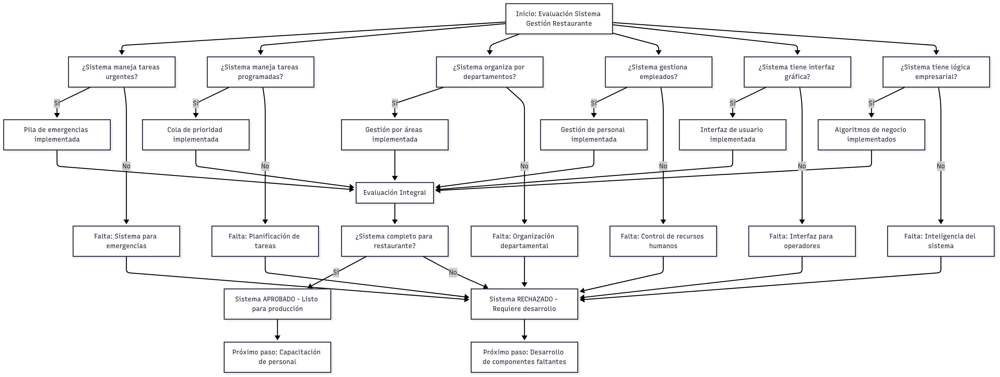
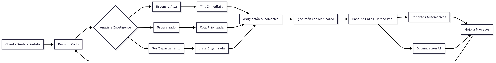
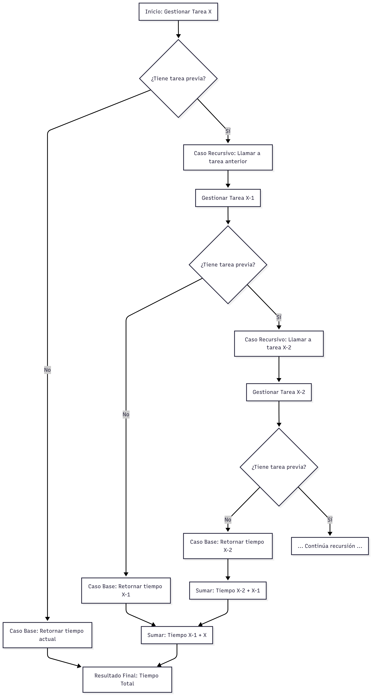

# 🍽️ Gestión de Tareas en Restaurante

 
 


Sistema de **gestión de tareas** diseñado para el restaurante *Restaurant Robert*.  
Este proyecto implementa estructuras de datos (pila, cola, lista y cola con prioridad) en **Java** para organizar y asignar tareas según su urgencia, prioridad y departamento.  

Incluye dos versiones:  
- 📌 **Consola (RestaurantePro.java)** → Menú interactivo textual.  
- 📌 **GUI (RestauranteAppGUI.java)** → Interfaz gráfica en **Swing**.  

---

## 📑 Índice
1. [Descripción del caso](#-descripción-del-caso)  
2. [Características principales](#-características-principales)  
3. [Requisitos del sistema](#-requisitos-del-sistema)  
4. [Instalación y ejecución](#-instalación-y-ejecución)  
5. [Estructura del proyecto](#-estructura-del-proyecto)  
6. [Uso](#-uso)  
7. [Pruebas realizadas](#-pruebas-realizadas)  
8. [Resultados](#-resultados)  
9. [Diagramas](#-diagramas)  
10. [Autores](#-autores)  
11. [Licencia](#-licencia)  

---

## 📌 Descripción del caso
El restaurante necesitaba un sistema que permitiera:  
- Atender **emergencias inmediatas** (ej. derrame en mesa).  
- Programar **tareas de rutina** (ej. limpieza de bodega).  
- Mantener dependencias lógicas entre tareas (ej. no iniciar *B* antes de *A*).  
- Mostrar en tiempo real las tareas asignadas a cada empleado.  

El sistema resuelve esto utilizando **estructuras de datos** de forma práctica y modular.  

---

## 🚀 Características principales
- Registro de tareas con **urgencia, prioridad y departamento**.  
- Asignación de tareas a empleados.  
- Administración mediante:
  - **Pila (LIFO):** tareas urgentes.  
  - **Cola (FIFO):** tareas programadas.  
  - **Cola con prioridad:** tareas críticas primero.  
  - **Lista:** clasificación por departamentos.  
- Ejecución desde **consola** o **interfaz gráfica**.  

---

## ⚙️ Requisitos del sistema
- **Java JDK 17+**  
- Sistema operativo: **Windows / Linux / MacOS**  
- Editor recomendado: IntelliJ IDEA, NetBeans o VS Code  

---

## 🖥️ Instalación y ejecución

### 1️⃣ Clonar el repositorio
```bash
git clone https://github.com/usuario/gestor-tareas-restaurante.git
cd "gestor-tareas-restaurante"
```

### 2️⃣ Compilar
```bash
javac *.java
```

### 3️⃣ Ejecutar versión consola
```bash
java RestaurantePro
```

### 4️⃣ Ejecutar versión GUI
```bash
java RestauranteAppGUI
```

---

## 📂 Estructura del proyecto
```
📦 Programa Restaurante
 ┣ 📜 Main.java
 ┣ 📜 RestaurantePro.java       # Versión consola
 ┣ 📜 RestauranteAppGUI.java    # Versión gráfica (Swing)
 ┣ 📜 Tarea.java
 ┣ 📜 Empleado.java
 ┣ 📜 PilaTareas.java
 ┣ 📜 ColaTareas.java
 ┣ 📜 ColaPrioridades.java
 ┣ 📜 ListaTareas.java
 ┣ 📜 diagrama1.png
 ┣ 📜 diagrama2.png
 ┣ 📜 diagrama3.png
 ┗ 📜 README.md
```

---

## 📖 Uso
### Menú en consola:
1. Registrar tareas.  
2. Asignar empleados.  
3. Ver tareas en pila, cola o lista.  
4. Atender o eliminar tareas.  

### Interfaz gráfica (Swing):
- Botones y tablas para manejar las tareas de forma intuitiva.  
- Ventanas emergentes para registrar y visualizar información.  

---

## ✅ Pruebas realizadas
- Agregar y atender **tareas urgentes** (pila → LIFO).  
- Agregar y atender **tareas programadas** (cola → FIFO).  
- Registrar **tareas con prioridad** (alta, media, baja).  
- Eliminar tareas por descripción en la lista.  
- Verificar funcionamiento en consola y GUI.  

---

## 📊 Resultados
✔ Las estructuras de datos funcionan correctamente.  
✔ El sistema soporta dos modos de interacción (consola y GUI).  
✔ La asignación de empleados se valida.  
✔ La GUI responde adecuadamente a eventos.  

---

## 🖼️ Diagramas
  
  
  

---

## 👨‍💻 Autores
- **André** → Implementación de estructuras de datos.  
- **Jevick** → Integración de GUI.  
- **Jordán** → Diseño modular y documentación.  
- **Roberto** → Coordinación y pruebas.  

---

## 📜 Licencia
Este proyecto está bajo la licencia [MIT](./LICENSE).  
